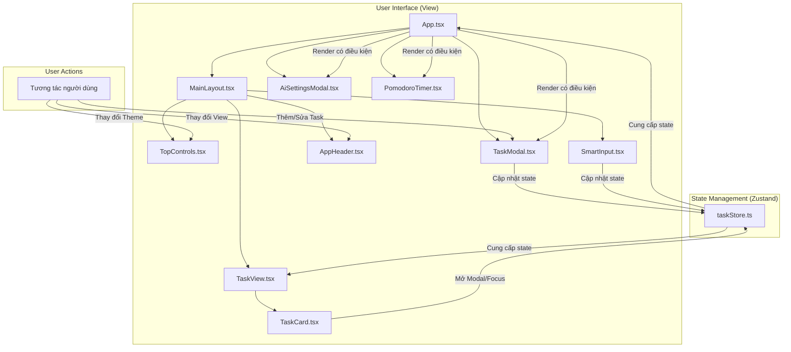

# Kiến trúc ứng dụng Quản lý công việc

Tài liệu này mô tả kiến trúc, công nghệ sử dụng và luồng hoạt động của ứng dụng quản lý công việc.

## 1. Công nghệ sử dụng

Ứng dụng được xây dựng bằng các công nghệ hiện đại, tập trung vào hiệu suất và trải nghiệm người dùng.

- **Framework Frontend:** [React](https://react.dev/) (`v18.2.0`) với [TypeScript](https://www.typescriptlang.org/) để đảm bảo mã nguồn an toàn và dễ bảo trì.
- **Build Tool:** [Vite](https://vitejs.dev/) (`v4.5.3`) cung cấp môi trường phát triển nhanh và tối ưu hóa quá trình build.
- **Quản lý State:** [Zustand](https://github.com/pmndrs/zustand) (`v4.5.4`) được sử dụng để quản lý trạng thái toàn cục một cách đơn giản, hiệu quả và ít boilerplate.
- **Kéo và Thả (Drag & Drop):** [`@dnd-kit`](https://dndkit.com/) được tích hợp để cho phép người dùng sắp xếp các công việc một cách trực quan.
- **Thành phần giao diện (UI Components):**
  - `react-datepicker`: Cung cấp bộ chọn ngày tháng.
  - `react-modal`: Dùng để tạo các cửa sổ modal.
  - `recharts`: Thư viện vẽ biểu đồ để hiển thị thống kê.
  - `react-icons`: Cung cấp một bộ sưu tập icon phong phú.
  - `react-tooltip`: Hiển thị các chú giải công cụ.
- **Linting & Formatting:** [ESLint](https://eslint.org/) được cấu hình để duy trì chất lượng và tính nhất quán của mã nguồn.

## 2. Cấu trúc thư mục

Cấu trúc thư mục được tổ chức theo chức năng, giúp dễ dàng tìm kiếm và phát triển.

```
/src
|-- assets/              # Chứa các tài nguyên tĩnh như hình ảnh, icon
|-- components/          # Các component UI chung, có thể tái sử dụng
|-- features/            # Các chức năng lớn của ứng dụng (ví dụ: tasks)
|   `-- tasks/
|       |-- components/  # Components dành riêng cho chức năng tasks
|       `-- TaskStyles.css
|-- hooks/               # Các custom hook (ví dụ: useTheme)
|-- layouts/             # Các component layout chính (ví dụ: MainLayout)
|-- stores/              # Các store của Zustand để quản lý state
|-- styles/              # Các tệp CSS toàn cục hoặc tiện ích
|-- utils/               # Các hàm tiện ích (ví dụ: api, effects)
|-- App.tsx              # Component gốc của ứng dụng
|-- main.tsx             # Điểm vào của ứng dụng
```

## 3. Luồng hoạt động và Kiến trúc

Kiến trúc ứng dụng được thiết kế theo mô hình component-based, với state được quản lý tập trung.

### Sơ đồ kiến trúc



### Diễn giải luồng hoạt động

1.  **Khởi tạo:**
    - `main.tsx` render `App.tsx`.
    - `App.tsx` khởi tạo `useTaskStore` để quản lý trạng thái của các công việc, modal, và các cài đặt khác. Nó cũng quản lý state cục bộ như `viewMode`.

2.  **Hiển thị giao diện:**
    - `App.tsx` render `MainLayout`, là khung sườn chính của ứng dụng.
    - `MainLayout` bao gồm:
        - `TopControls`: Các nút điều khiển chung.
        - `SmartInput`: Ô nhập liệu nhanh.
        - `AppHeader`: Chứa các tùy chọn thay đổi chế độ xem.
        - `TaskView`: Khu vực hiển thị danh sách công việc. `TaskView` lấy dữ liệu từ `taskStore` và render ra các component `TaskCard`.

3.  **Tương tác của người dùng:**
    - **Tạo/Sửa công việc:**
        - Người dùng có thể nhấp vào nút "Thêm công việc" hoặc một `TaskCard` hiện có.
        - Hành động này sẽ cập nhật `taskStore` (ví dụ: `setEditingTask(task)`, `openTaskModal()`).
        - `App.tsx` lắng nghe sự thay đổi này và hiển thị `TaskModal`.
        - Sau khi người dùng lưu, `TaskModal` sẽ gọi các hàm trong `taskStore` (`addTask`, `updateTask`) để cập nhật dữ liệu.
        - `TaskView` sẽ tự động render lại với dữ liệu mới.
    - **Thay đổi chế độ xem:**
        - Người dùng chọn chế độ xem "Lưới" hoặc "Lịch" trong `AppHeader`.
        - `onViewModeChange` được gọi, cập nhật state `viewMode` trong `App.tsx`.
        - `TaskView` nhận `viewMode` mới và thay đổi cách hiển thị danh sách công việc.
    - **Sử dụng Pomodoro:**
        - Người dùng bật/tắt `PomodoroTimer` từ `TopControls`.
        - `App.tsx` hiển thị hoặc ẩn component `PomodoroTimer` dựa trên state `isPomodoroVisible`.

Kiến trúc này giúp tách biệt rõ ràng giữa giao diện (View), dữ liệu (State), và logic xử lý, làm cho ứng dụng dễ dàng mở rộng và bảo trì.