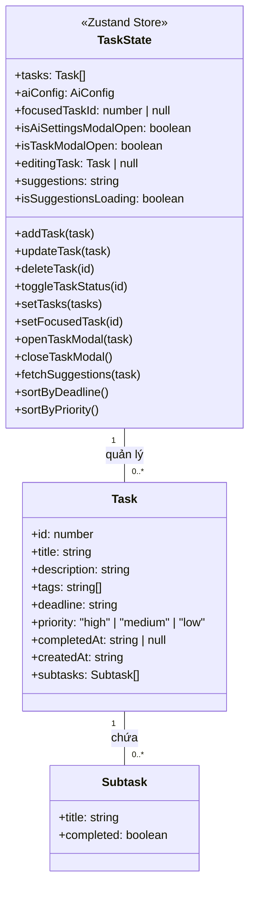
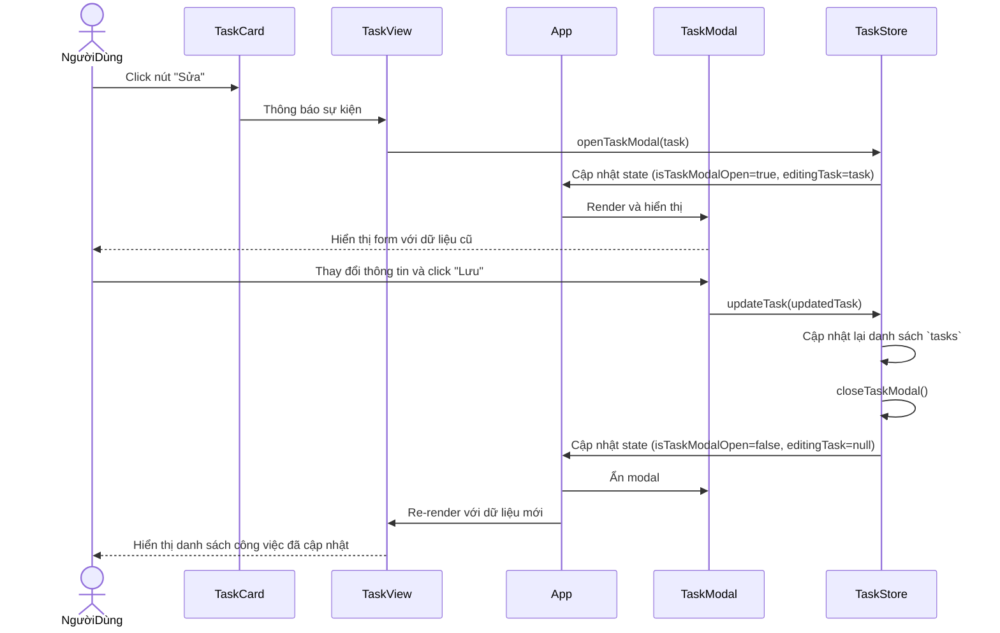

# Các Sơ đồ Hệ thống

Tài liệu này chứa các sơ đồ UML (Unified Modeling Language) để trực quan hóa kiến trúc và luồng hoạt động của ứng dụng quản lý công việc. Các sơ đồ được vẽ bằng cú pháp Mermaid.

---

## 1. Sơ đồ Use Case

Sơ đồ này mô tả các tương tác chính giữa người dùng (Actor) và hệ thống.

```mermaid
graph TD
    actor NgườiDùng as "Người Dùng"

    subgraph "Hệ thống Quản lý Công việc"
        uc1[Quản lý Công việc (CRUD)]
        uc2[Sắp xếp Công việc]
        uc3[Thay đổi Chế độ xem]
        uc4[Quản lý Trạng thái Tập trung]
        uc5[Sử dụng Đồng hồ Pomodoro]
        uc6[Tùy chỉnh Giao diện]
        uc7[Xem Thống kê]
        uc8[Nhận Gợi ý từ AI]
    end

    NgườiDùng --> uc1
    NgườiDùng --> uc2
    NgườiDùng --> uc3
    NgườiDùng --> uc4
    NgườiDùng --> uc5
    NgườiDùng --> uc6
    NgườiDùng --> uc7
    NgườiDùng --> uc8

    uc1 -->|Bao gồm| uc8
```

**Diễn giải:**
- Người dùng có thể thực hiện các hành động quản lý công việc cơ bản (Tạo, Đọc, Cập nhật, Xóa).
- Khi tạo/sửa công việc, hệ thống có thể bao gồm cả chức năng nhận gợi ý từ AI.
- Các chức năng khác bao gồm sắp xếp, thay đổi chế độ xem, quản lý chế độ tập trung, sử dụng Pomodoro, tùy chỉnh giao diện và xem thống kê.

---

## 2. Sơ đồ Lớp (Mô hình Dữ liệu)

Sơ đồ này mô tả cấu trúc của các đối tượng dữ liệu chính và store quản lý trạng thái.



**Diễn giải:**
- `Task` là đối tượng trung tâm, chứa các thông tin chi tiết và một danh sách các `Subtask`.
- `TaskState` là store của Zustand, chứa một mảng các đối tượng `Task` và các phương thức để thao tác với chúng.

---

## 3. Sơ đồ Trạng thái (Vòng đời của Công việc)

Sơ đồ này mô tả các trạng thái khác nhau của một đối tượng `Task` và các sự kiện gây ra sự chuyển đổi giữa các trạng thái.

```mermaid
stateDiagram-v2
    [*] --> Pending : Tạo mới

    state Pending {
        description: Công việc đang chờ thực hiện
    }

    state Completed {
        description: Công việc đã hoàn thành
    }

    Pending --> Completed : toggleTaskStatus() [chưa hoàn thành]
    Completed --> Pending : toggleTaskStatus() [đã hoàn thành]
    Pending --> [*] : deleteTask()
    Completed --> [*] : deleteTask()
```

**Diễn giải:**
- Một công việc khi được tạo sẽ ở trạng thái `Pending`.
- Hành động `toggleTaskStatus()` sẽ chuyển đổi trạng thái giữa `Pending` và `Completed`.
- Từ bất kỳ trạng thái nào, hành động `deleteTask()` sẽ xóa công việc khỏi hệ thống.

---

## 4. Sơ đồ Tuần tự (Luồng Cập nhật Công việc)

Sơ đồ này minh họa chi tiết cách các thành phần tương tác với nhau khi người dùng cập nhật một công việc.



**Diễn giải:**
- Luồng bắt đầu khi người dùng tương tác với `TaskCard`.
- Các sự kiện được truyền lên các component cha và cuối cùng gọi đến `TaskStore`.
- `TaskStore` cập nhật trạng thái, khiến cho `App` và các component con của nó (như `TaskModal`, `TaskView`) tự động render lại để phản ánh sự thay đổi.